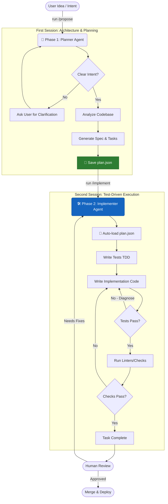
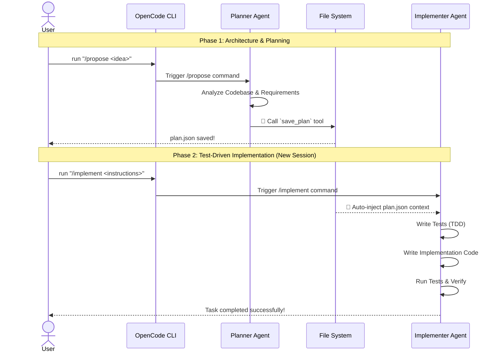
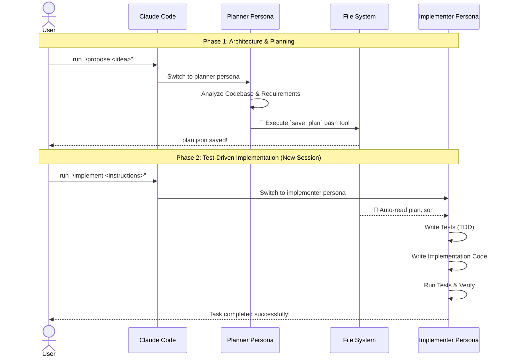

# cli-use-core

[](https://badge.fury.io/js/cli-use-core)

An Agentic Planning and TDD (Test-Driven Development) CLI adapter tool.

## 🚀 Installation & Setup

**Prerequisites**

This tool requires either the OpenCode CLI or Claude Code. If you don't have them installed yet, install them globally via npm:

```bash
# For OpenCode:
npm install -g @opencode-ai/cli

# For Claude Code:
npm install -g @anthropic-ai/claude-code
```

**1. Install the package**

```bash
npm install cli-use-core
```

**2. Auto-Setup for OpenCode & Claude Code (Recommended)**

Run the following command to automatically generate the required plugin configuration files for both platforms in your project:

```bash
npx cli-use-core init all
```

_(You can also pass `opencode` or `claude` instead of `all` to set up a specific platform)._

**To Uninstall/Remove Configs:**
If you ever want to cleanly remove the generated configuration files, run:

```bash
npx cli-use-core remove all
```

**3. Manual Setup (Alternative)**

<details>
<summary>Click to view manual setup instructions</summary>

**For OpenCode:**
Create an `opencode-plugin.ts` file in your project root to export the plugin:

```typescript
import { cliUsePlugin } from "cli-use-core/plugin";

export default cliUsePlugin;
```

Then, create or update `.opencode/opencode.json` to load your local plugin file:

```json
{
  "$schema": "https://opencode.ai/config.json",
  "plugin": ["../opencode-plugin.ts"]
}
```

**For Claude Code:**
You can manually copy the plugin hooks and prompts into your project root:

```bash
cp -r node_modules/cli-use-core/.claude-plugin .
```

</details>

## 📚 Command Catalog

This tool injects custom commands into your OpenCode / Claude Code environments, as well as providing its own CLI utilities.

### Agent Commands (OpenCode / Claude Code)

These commands switch contexts and engage the specialized AI agents.

| Command      | Arguments                       | Description                                                                                                                                                        |
| :----------- | :------------------------------ | :----------------------------------------------------------------------------------------------------------------------------------------------------------------- |
| `/propose`   | `<idea or feature description>` | Switches to the **Planner Agent**. Analyzes your request, reads the codebase (read-only), and generates a strict TDD architecture plan using the `save_plan` tool. |
| `/implement` | `[optional instructions]`       | Switches to the **Implementer Agent**. Automatically reads the latest saved plan and begins writing tests and implementation code to fulfill it.                   |

### CLI Utilities

These commands are run in your standard terminal to manage the tool's installation in your project.

| Command                   | Arguments                     | Description                                                                                                              |
| :------------------------ | :---------------------------- | :----------------------------------------------------------------------------------------------------------------------- |
| `npx cli-use-core init`   | `<opencode \| claude \| all>` | Bootstraps the required configuration files and plugin paths for the specified platform(s) into your current repository. |
| `npx cli-use-core remove` | `<opencode \| claude \| all>` | Safely removes the generated plugin configurations and directories from your project.                                    |

---

## 🧠 The Dual-Agent Workflow (Idea to Implementation)

This tool separates the _thinking_ from the _doing_. Instead of a single AI trying to design and code simultaneously (which often leads to hallucinations), we use a strict two-step pipeline.

**Phase 1: Architecture & Planning**
Start by asking the **Planner Agent** to architect your feature. The planner cannot write code—its only job is to analyze your codebase, clarify requirements, and write a strict specification plan.

```bash
npx opencode run "/propose Add a new authentication system with JWT"
```

_Result: The planner uses the `save_plan` tool to generate a detailed spec and task list, saving it locally to `cli-use/changes/latest/plan.json`._

**Phase 2: Test-Driven Implementation**
Once the plan is saved, you switch to the **Implementer Agent** to execute it in a new session. The implementer automatically reads the plan generated in Phase 1 and begins coding step-by-step.

```bash
npx opencode run "/implement start by writing the tests for task 1"
```

_Result: The implementer strictly follows the `plan.json`, writes the tests first, implements the logic, and executes your project's test suite to ensure everything passes._

#### Visual Workflows

**1. The Complete Lifecycle (Macro View)**


```mermaid
graph TD
    A([User Idea / Intent]) -->|run /propose| B(🧠 Phase 1: Planner Agent)

    subgraph First Session: Architecture & Planning
        B --> C{Clear Intent?}
        C -->|No| D[Ask User for Clarification]
        D --> B
        C -->|Yes| E[Analyze Codebase]
        E --> F[Generate Spec & Tasks]
        F --> G[💾 Save plan.json]
    end

    G -->|run /implement| H(🛠️ Phase 2: Implementer Agent)

    subgraph Second Session: Test-Driven Execution
        H --> I[📖 Auto-load plan.json]
        I --> J[Write Tests TDD]
        J --> K[Write Implementation Code]
        K --> L{Tests Pass?}
        L -->|No - Diagnose| K
        L -->|Yes| M[Run Linters/Checks]
        M --> N{Checks Pass?}
        N -->|No| K
        N -->|Yes| O[Task Complete]
    end

    O --> P([Human Review])
    P -->|Needs Fixes| H
    P -->|Approved| Q([Merge & Deploy])

    style G fill:#2e7d32,stroke:#1b5e20,color:#fff
    style H fill:#1565c0,stroke:#0d47a1,color:#fff
```

**2. The CLI Interaction Sequence (OpenCode)**


```mermaid
sequenceDiagram
    actor User
    participant CLI as OpenCode CLI
    participant Planner as Planner Agent
    participant FS as File System
    participant Impl as Implementer Agent

    Note over User, Impl: Phase 1: Architecture & Planning
    User->>CLI: run "/propose <idea>"
    CLI->>Planner: Trigger /propose command
    Planner->>Planner: Analyze Codebase & Requirements
    Planner->>FS: 💾 Call `save_plan` tool
    FS-->>User: plan.json saved!

    Note over User, Impl: Phase 2: Test-Driven Implementation (New Session)
    User->>CLI: run "/implement <instructions>"
    CLI->>Impl: Trigger /implement command
    FS-->>Impl: 📖 Auto-inject plan.json context
    Impl->>Impl: Write Tests (TDD)
    Impl->>Impl: Write Implementation Code
    Impl->>Impl: Run Tests & Verify
    Impl-->>User: Task completed successfully!
```

**3. The CLI Interaction Sequence (Claude Code)**


```mermaid
sequenceDiagram
    actor User
    participant CLI as Claude Code
    participant Planner as Planner Persona
    participant FS as File System
    participant Impl as Implementer Persona

    Note over User, Impl: Phase 1: Architecture & Planning
    User->>CLI: run "/propose <idea>"
    CLI->>Planner: Switch to planner persona
    Planner->>Planner: Analyze Codebase & Requirements
    Planner->>FS: 💾 Execute `save_plan` bash tool
    FS-->>User: plan.json saved!

    Note over User, Impl: Phase 2: Test-Driven Implementation (New Session)
    User->>CLI: run "/implement <instructions>"
    CLI->>Impl: Switch to implementer persona
    FS-->>Impl: 📖 Auto-read plan.json
    Impl->>Impl: Write Tests (TDD)
    Impl->>Impl: Write Implementation Code
    Impl->>Impl: Run Tests & Verify
    Impl-->>User: Task completed successfully!
```

---

This tool acts as your automated Tech Lead within dual-agent contexts across platforms like **OpenCode** and **Claude Code**. It generates strict Product Requirements (Specs), Test Plans, and Implementation Steps _before_ you write a single line of code, preventing AI hallucinations and saving hours of debugging.

## ✨ Features

- **Platform Agnostic Core:** The core logic is headless and stateless, running smoothly inside OpenCode (in-process) and Claude Code (out-of-process).
- **Markdown-as-State:** All plans are saved locally to `cli-use/changes/latest/plan.json` so you never lose context.
- **Silent Guardians:** Invisible background validation prevents bad or destructive AI code edits (e.g., leaving `console.log` statements in generated code).

---

## 🛠️ Local Development & Testing

This project implements a dual-agent context across both **OpenCode** and **Claude Code** platforms.

### Prerequisites & Building

1. **Install Dependencies:**

   ```bash
   npm install
   ```

2. **Build the Plugin:**
   The core logic and the OpenCode plugin adapter are bundled using `tsup`.

   ```bash
   npm run build
   ```

   _This outputs `dist/index.js` (core) and `dist/opencode-plugin.js` (OpenCode adapter)._

3. **Verify the Codebase:**
   Before running agents, ensure all strict TDD constraints are met:
   ```bash
   npm run lint        # Validates code formatting and rules
   npm run typecheck   # Validates TypeScript typings
   npm run test        # Runs the Vitest suite covering Core, OpenCode, and Claude Code adapters
   ```

---

### 🧪 Testing the OpenCode Adapter Locally

The OpenCode adapter registers the `cli-use-planner` and `cli-use-implementer` agents programmatically, alongside custom `/propose` and `/implement` commands.

1. **Configure OpenCode:**
   Ensure you create an `opencode-plugin.ts` file in the root that exports the built plugin:

   ```typescript
   import { cliUsePlugin } from "./dist/opencode-plugin.js";

   export default cliUsePlugin;
   ```

   And then load it in `.opencode/opencode.json` (see `opencode.example.json`):

   ```json
   {
     "$schema": "https://opencode.ai/config.json",
     "plugin": ["../opencode-plugin.ts"]
   }
   ```

2. **Engage the Planner:**
   Use the custom `/propose` command to trigger the `cli-use-planner` agent. The planner will analyze requirements and use the `save_plan` tool to write the state to disk.

   ```bash
   npx opencode run "/propose Add a new authentication system"
   ```

3. **Engage the Implementer:**
   Use the custom `/implement` command to trigger the `cli-use-implementer`. This agent uses the `chat.params` hook to automatically read `cli-use/changes/latest/plan.json` into its system prompt context.
   ```bash
   npx opencode run "/implement Let's start with task 1"
   ```

_Note on OpenCode Validation:_ If the implementer attempts to write forbidden code (e.g., leaving `console.log` in the file), the `tool.execute.after` hook will intercept the action and silently throw an error to the LLM to force self-correction.

---

### 🤖 Testing the Claude Code Adapter Locally

The Claude Code adapter uses static manifests (`.claude-plugin/`), a `SKILL.md` file for permissions, and `stdin`-based Node scripts to validate execution.

1. **Start Claude Code:**
   Launch Claude Code within the repository root so it automatically detects the `.claude-plugin` directory:

   ```bash
   claude
   ```

2. **Use the Custom Commands:**
   Invoke the markdown-defined commands directly in the prompt:
   - Type `/propose [your goal]` to switch to the `planner` persona. The planner uses the bash-wrapped `save_plan.ts` script to generate architecture plans.
   - Type `/implement` to switch to the `implementer` persona, which reads `.planning/db.json` (or the respective JSON plan).

3. **Test Stateless Validation (The Silent Guardian):**
   When the implementer tries to edit or write a file using Claude Code's native tools, the `.claude-plugin/hooks.json` maps `PreToolUse` hooks to `bin/claude-validate.ts`.

   To manually test this validation script:

   ```bash
   # Valid code (Exits 0)
   echo '{"newString": "const x = 1;"}' | npx tsx bin/claude-validate.ts

   # Invalid code (Blocks execution, Exits 2)
   echo '{"newString": "console.log(\"test\");"}' | npx tsx bin/claude-validate.ts
   ```

---

### 📦 Local End-to-End Testing (Simulated npm install)

To ensure the published package artifacts and the CLI commands behave correctly in a fresh consumer environment without actually publishing to the registry, we provide an automated E2E script:

```bash
npm run test:pack
```

**What this script does:**

1. Compiles the project (`npm run build`).
2. Generates a release-ready tarball (`npm pack`).
3. Creates a clean, isolated dummy environment (`test-pack-env/`).
4. Installs the tarball artifact to simulate a real-world user download.
5. Executes `npx cli-use-core init all` to verify all configuration files are correctly injected.
6. Executes `npx cli-use-core remove all` to verify cleanup logic works cleanly.

_(To manually clean up the test environment afterward, you can run `rm -rf test-pack-env *.tgz`)_

**Manual Tarball Generation:**
If you prefer to manually generate the `.tgz` artifact without running the full testing script, you can run the following command in the root directory:

```bash
npm pack
```

This will bundle the project based on the `files` array in `package.json` and generate a `.tgz` file in your current directory.
